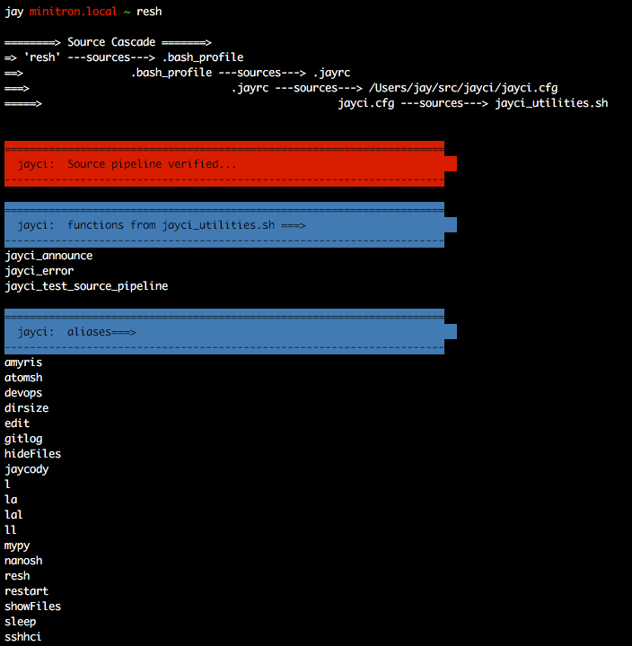

# jayci
> Mini CI/CD framework for my personal projects
__________________

## Setup:
1. Clone `jayci` repo to `~/jaycody` and `cd jayci`
2. Symlink the expected config locations in `~/.*` to actual config files  in `jayci/` & `jayci/configs/`(insert script here)
```bash
# symlink the actual `jayci/.jayrc` config file to the expected location `~/.jayrc`
ln -s $HOME/jaycody/jayci/.jayrc $HOME/.jayrc

# symlink htop's actual config file, `jayci/configs/htoprc` to its expected location `~/.config/htop/htoprc`
ln -s $HOME/jaycody/jayci/configs/htoprc $HOME/.config/htop/htoprc
```
3. Append `.bash_profile` with instructions to source `${HOME}/.jayrc`
```bash
# Source .jayrc if .jayrc is present
if [ -f $HOME/.jayrc ]; then
	source $HOME/.jayrc
fi
```
__________________

## create and update a feature branch:
```bash
# update master
git checkout master
git pull

# create feature branch from master [-b create <branch>]
git checkout -b <feature_branch> master
git push -u origin <feature_branch>

#### MAGIC HERE ####

# update local feature branch
git add -A
git commit -m 'wittiness-o-rama'

# update remote feature branch 
git push

# update local feature branch with master
git checkout master
git pull
git checkout <feature_branch>
git merge master

# safely abort a merge that isn't going well
git merge --abort

# update remote feature branch with (the now current) local feature branch
git push


# submit MR on github - healthy git hygiene
# pull master and verify changes

# delete feature branch
git branch -d <feature_branch>

```

## To switch to feature branch

```bash
# list branches (local and remote)
git branch -a

# then switch to local branch
git checkout <local_branch_name>
# or
git switch <local_branch_name>

# or switch to a remote branch:
git fetch
git checkout -t origin/<feature_branch> #[-t track this branch from origin]


# To checkout a branch from a specific commit
git log --oneline --graph  # or gitlog via alias
git checkout -B <branch_name> <starting_point>

```

## Git Commands to run Often (100% Safe)

```bash
# Show status of repository
git status
# Show commit history
git log
# Show all branches (including remote)
git branch -a
# View diff between working copy and staging area (index)
git diff
# View diff between staging area and local repository
git diff --staged
# List all stashed changesets
git stash list
# Update local copy of remote repository
git fetch origin
```

## Other Useful Commands

```bash
# Get help
git help
# Get help for <COMMAND>
git help <COMMAND>
# Show changes introduced by most recent commit
git show
# Show changes introduced by <SOME-COMMIT>
git show <SOME-COMMIT>
# Fetch origin and remove your local copy of other
# people's branches that no longer exist on remote:
git fetch origin --prune
# Temporarily stash away all changes in your currently checked out working copy
git stash
# List all stashed changesets
git stash list
# Bring back stashed changes later (use most recently stashed changeset)
git stash apply
# Bring back stashed changes later (use changeset <STASH>)
git stash apply <STASH>
# Delete a changeset from the stash
git stash drop <STASH>
```


## `git pull` is short for `git fetch` plus `git merge`

- `git merge` will always merge into the branch that is currently checked out.
- `git rebase` will always rebase the branch that is currently checked out.
- `git pull` will always pull into the branch that is currently checked out.
- `git pull` is just a shortcut for `git fetch` followed by a `git merge`. This
is the reason why you can encounter merge conflicts when you pull but never when
you just fetch. `git fetch` only updates your **local copy of the remote
repository** (always safe to do) but doesn't try to merge those changes into
your local repository yet.
    ```bash
    git checkout myfeature_JV
    git fetch origin
    git merge origin/master
    ```
    is equivalent to
    ```bash
    git checkout myfeature_JV
    git pull origin master
    ```


## git tags

```bash
# list local tags [-n for extensive]
git tag -n

# create local tag with annotations
git tag -a <tag_name> -m "<tag_annotation>"

# delete local tag
git tag -d <tag_name>

# view tag contents
git show <tag_name>

# push local tags to remote
git push --tags

# pull remote tags
git fetch --all --tags

```


## Antipatterns

- Cross-merging between feature branches (instead, always branch off of and
merge back into master, if possible)
- Huge commits grouping unrelated changes
- Uninformative commit messages
- Commit messages without prefix

## Git Commit Prefixes

Commit prefixes that categorize each code commit. 
Recommended that you include any Jira ticket
identifiers in your commit messages.

  - ADD:  
    Add module to repository

  - BCH:  
    Repository branch

  - BUG:  
    Bug fix. Either in response to a filed ticket or a bug you discover.
    Ideally, a jira ticket id (ie: HERMES-73) should be included where
    possible.

  - BUR:  
    Bureaucracy and paperwork such as 360 reports and monthlies. And
    burros.

  - CNF:  
    Configuration file change.

  - DOC:  
    Documentation update. Might be a reStructuredText doc change, a
    docstring, a code comment, or a release note.

  - EGG:  
    Adding a new egg.

  - ENH:  
    Feature enhancement. You've added a new feature to the code, maybe
    one the users will notice.

  - GUI:  
    GUI update.

  - LNT:  
    Lint elimination. Often in response to pylint messages.

  - LOG:  
    Change to logging.

  - MNT:  
    General code or repository maintenance, file renames, server admin,
    etc.

  - MRG:  
    Branch merging. Often merging others' changes.

  - REF:  
    Code refactoring.

  - REQ:  
    Change to dependency requirements.

  - SEC:  
    Security and authorization.

  - SQL:  
    SQL scripts and migrations.

  - TST:  
    Update to test code.

  - VER:  
    Project version change in the specific project, not in dependencies.


## Undoing Changes

If you've messed up your working copy but haven't added those changes to the
index or commited them yet, you can reset your working copy using

```bash
git checkout <file_you_want_to_reset.txt>
```

If you want to drop *all* unstaged changes in your working directory, you can do 

```bash
git checkout .
```

If you've messed up your local branch by commiting stuff that you never wanted
to commit, and now you want to completely undo (**ERASE FROM HISTORY FOREVER**)
those commits, you can go back to `<SOME-COMMIT>` using

```bash
git reset --hard <SOME-COMMIT>
```

**NOTE:**
- This is a potentially dangerous command. Use with caution. It will throw away
all uncommited changes, then reset your current branch to `<SOME-COMMIT>`, then
reset your index and working copy so they look like the reset branch, too.
- If you have uncommited changes that you still want to use later (check git
status before running this command!), stash them before the reset.

If you need to "undo" a git commit that you have already pushed to the
remote repository, you can use `git revert`. Git revert accepts a commit
hash, and will create a new commit whose changes undo the changes
introduced in the referenced commit.

This becomes more tricky if the commit you need to revert is a merge.
You *can* revert a merge using git revert. You have to specify which
upstream commit of the merge should be considered as the base commit to
which the other branch made changes. This is the `-m` option. Annoyingly,
`-m` accepts a "parent number" rather than the commit hash of the parent
commit you want to use. "parent numbers" are indexed from 1. The output
of git log lists the parent commits for a merge commit in order of
parent number. For instance:

```
commit a2481cdf7120917ec084806e4339954460b8e342
Merge: 4206527 dc3d482
Author: ...
Date: ...
Merge branches 'foo' and 'master' of git.amyris.local:amyris/bar
```

The line Merge: 4206527 dc3d482 shows that commit 4206527 is parent
number 1 and commit dc3d482 is parent number 2. In my case, commit
dc3d482 was the commit on the master branch, and commit 4206527 was the
last commit on the branch that was accidentally merged into master.
Thus, to revert that merge, I ran `git revert -m 2
a2481cdf7120917ec084806e4339954460b8e342`

There is a wrinkle here, though. Revert eliminates the data that was
added in the commit, but it doesn't erase the history that says "all of
these changes were merged into master". So, if you attempt to merge that
same branch back into master at a future time, *none of the changes you
reverted will appear in master* because the repo history already says
that they have been merged in\!

This post explains further:
<https://github.com/git/git/blob/master/Documentation/howto/revert-a-faulty-merge.txt>

The short version is that if you want the changes from the feature
branch that you merged and then reverted the merge, you need to revert
the revert that undid the merge, effectively re-adding the changes from
that merge. PITA. There are some other options in the above link.


______________________________

## Sourcing Cascade Order
Here's the cascade order once .bash_profile is updated and a symlink created for .jayrc:

| FILE | ACTION |
|------|--------|
| `.bash_profile` | ---_sources_---> `.jayrc`
| `.jayrc` | ---_sources_---> `jayci.cfg` (and any other .cfg file for projects in the workspace
|        | exports globals (eg `export WORKSPACE=${HOME}/src`)
|        | sets aliases
|        | sets path
| `jayci.cfg` | ---_sources_---> `jayci_utilities.sh`
| `jayci_utilities.sh` | repo-specific utility functions
| `jayci.cfg` | ---_sources_---> `.git-prompt.sh`
| `.git-prompt.sh` | displays git repo at the prompt

__________________________

## `jayrc` config file
* set prompt,
* export globals,
* ammend paths,
* make aliases,
* source config and scipt files

_________________________

## Useful commands

```bash
# list function names whose prefix is 'jayci'
compgen -A function | grep jayci

# list my aliases
compgen -a
```

## Verification Messages



## Miscellaneous Resources

  - CIA's Git
    [Hints](https://wikileaks.org/ciav7p1/cms/page_1179773.html)
